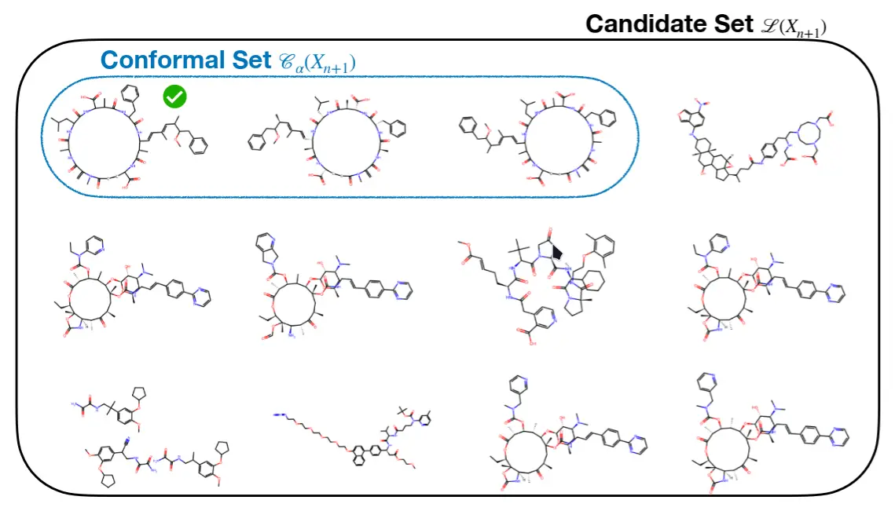

# Conformal Graph Prediction with Z-Gromov Wasserstein Distances

<p align="center">
  <!-- Python Version -->
  
  <!-- PyTorch Version -->
  
  <!-- arXiv Link -->
  <a href="https://arxiv.org/abs/2603.02460"></a>
  <!-- OpenReview Link -->
  <a href="https://openreview.net/forum?id=6kfj974DiF"></a>
  <!-- UAI 2026 Venue Link -->
  <a href="https://www.auai.org/uai2026/"></a>
</p>

Code for the [Conformal Graph Prediction with Z-Gromov Wasserstein Distances](https://arxiv.org/abs/2603.02460) paper published in UAI 2026.

> Supervised graph prediction addresses regression problems where
> the outputs are structured graphs. Although several approaches
> exist for graph-valued prediction, principled uncertainty
> quantification remains limited. We propose a conformal
> prediction framework for graph-valued outputs, providing
> distribution-free coverage guarantees in structured output spaces.
> Our method defines nonconformity via the
> Z-Gromov-Wasserstein distance, instantiated in practice
> through Fused Gromov-Wasserstein (FGW),
> enabling permutation invariant comparison between predicted
> and candidate graphs.
> To obtain adaptive prediction sets, we introduce Score Conformalized Quantile Regression (SCQR), an extension of Conformalized Quantile Regression (CQR) to handle complex output spaces such as graph-valued outputs. We evaluate the proposed approach on a synthetic task and a real problem of molecule identification.

_Gabriel Melo, Thibaut de Saivre, Anna Calissano, Florence d’Alché-Buc_



Installation:

```bash
uv sync --all-groups
```

Then source the virtual environment at `.venv`.

## MIST

Minimal setup (warning: may require a lot of RAM, 70GB+):

```bash
cd mist
sh data_processing/canopus_train/00_download_canopus_data.sh
sh data_processing/canopus_train/01_run_subform.sh

sh data_processing/mol_libraries/pubchem/01_download_smiles.sh
sh data_processing/mol_libraries/pubchem/02_make_formula_subsets.sh

python data_processing/canopus_train/03_retrieval_hdf.py

sh quickstart/model_predictions/00_download_models.sh
```

The files we need in the end are the following:

- `mist/quickstart/pretrained_models/mist_contrastive_canopus_pretrain.ckpt`

- `mist/data/paired_spectra/canopus_train/labels.tsv`
- `mist/data/paired_spectra/canopus_train/spec_files/`

- `mist/data/paired_spectra/canopus_train/splits/canopus_hplus_100_0.tsv`

After running `03_retrieval_hdf.py`:

- `mist/data/paired_spectra/canopus_train/retrieval_hdf/intpubchem_with_morgan4096_retrieval_db.h5`

## Any2Graph

Graph-Valued Regression [Model repo](https://github.com/KrzakalaPaul/Any2Graph)
